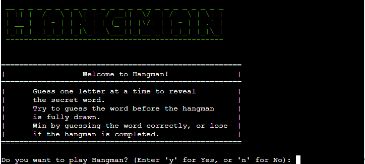
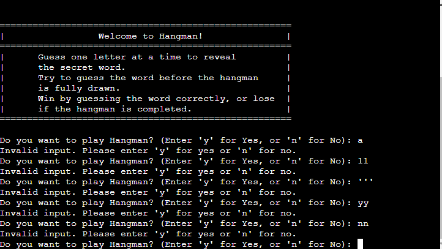
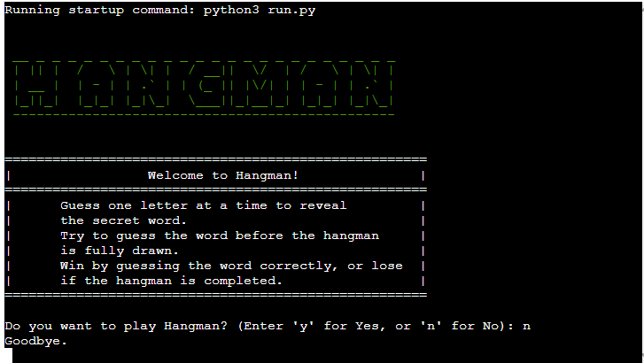
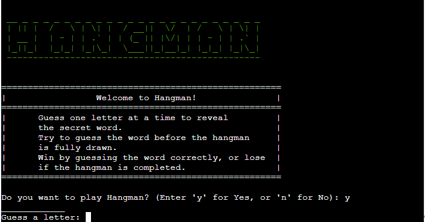
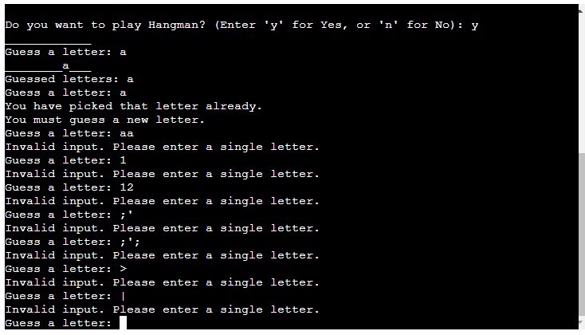
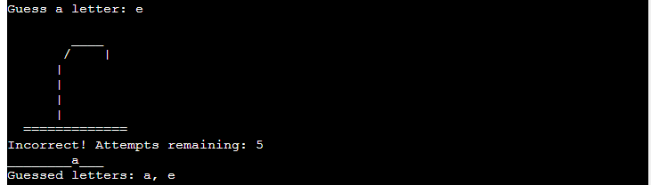
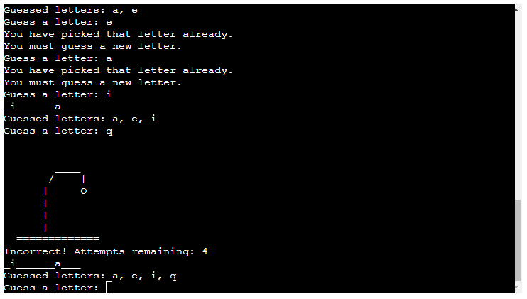
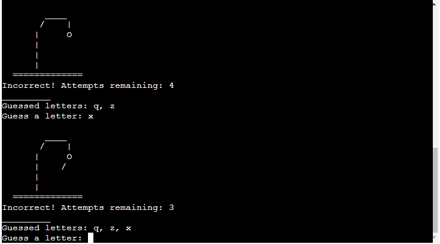
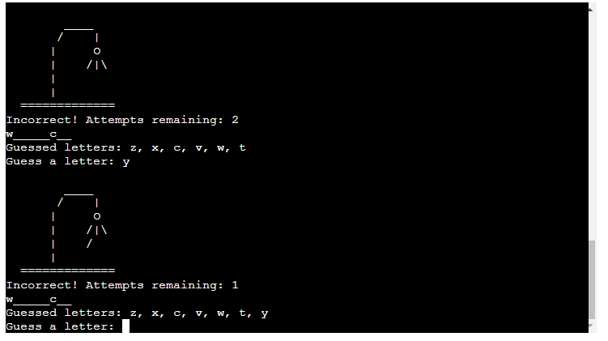
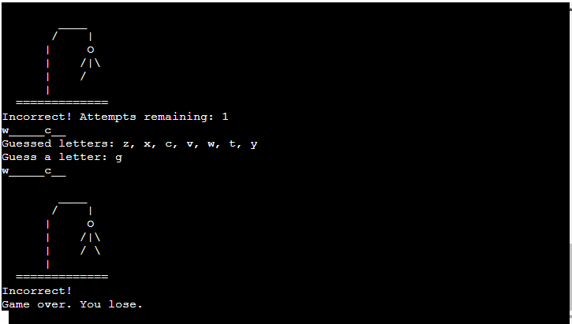

# Hangman

Welcome to the Python CLI Hangman Game! 
This command-line game is a fun and interactive way to test your vocabulary and word-guessing skills. Challenge yourself or play with friends to see who can guess the hidden word correctly.
### Deployed website [Hangman](xxx/ 'Hangman')

## Contents

* [Technologies Used](#technologies-used)

## Purpose

The purpose of this programme is to make an interactive Hangman cli game for users to play.

This programme is developed to demonstrate competency in python programming and is for educational purposes.

## Program Flowchart

# How to Play
Hangman is a word-guessing game where one player (the computer) thinks of a word, and the other player (you) tries to guess that word by suggesting letters. You can read more about it on [Wikipedia](https://en.wikipedia.org/wiki/Hangman_(game) 'Hangman').

Here's how to play:

- Setup: The computer randomly selects a word and displays it as underscores for each letter (e.g., "_ _ _ _ _ _ _").

- Guessing: You start by guessing one letter at a time. If the guessed letter is correct, it's revealed in the word. If incorrect, the computer keeps track of incorrect guesses.

- Objective: Your goal is to guess the word before the computer completes drawing the hangman figure.

- Win or Lose: You win if you guess the word correctly. The computer wins if it completes the hangman figure before you guess the word.

- Strategy: Start with common vowels, avoid repeating incorrect guesses, and pay attention to the hangman figure's progress.

Enjoy playing Hangman against the computer in our Python CLI game!
# Features

## Existing Features
### Welcome screen
* When the game loads the player sees the Hangman logo. The logo has been created using ascii art, a welcome message and instructions on how to play the game are displayed.
* The user is asked if they want to play Hangman and prompted to enter 'y' for Yes or 'n' for No.

### Input validation
* The player input is validated. If the user does not enter either 'y' or 'n' they are prompted to enter a correct oprion.

### User selects 'n'
* If the user enters 'n' the game ends and a goodbye message is printed to the screen.

### User selects 'y'
* If the user eneters 'y' the game begins. 
* The programme makes a call to the Google Spreadsheet where various words are saved. 
* The programme randomly selects a word from a predefined list of words for the player to guess. 
* The programmes displays a blank space for each letter in the word (e.g. '________').

### Guessing 
* The player can guess letters one by one to reveal the hidden word.
* If the letter guessed by the player is a letter in the word, the display be will be updated with occureneces of that letter. 
* The programme will only accept a single alphanumeric character (a through z). 
* If the user doesn't enter a single alphanumeric character they will be asked to enter a single letter. 
* If the user has already entered a letter in a previous guess, they will be asked to enter a new letter.
* The letters that the user has guessed are displayed
 on the screen.

## Incorrect Guess Tracking: 
* The game keeps track of incorrect guesses and displays a hangman figure using ASCII art as the game progresses.
* The player has 6 lives when the game starts. Each time a player guesses incorrectly they lose a life and the hangman art is updated and displayed.

### Incorrect Guess One

### Incorrect Guess Two

### Incorrect Guess Three

### Incorrect Guess Four

### Incorrect Guess Five

# Win/Lose Conditions: 
* The game ends when the player either correctly guesses the word or makes too many incorrect guesses (hangman is fully drawn).

## Player Loses
* When the player runs out of lives the game ends.
* The completed hangman graphic is displayed along with a message telling thh user their letter chocie was incorrect and the game is over.

* This message is displayed for a number of seconds, after which the console is cleared and the game is loaded again. 
* The welcome screen is loaded and the player has the option to start a new game.

## Player Wins

- Word Reveal: After the game ends, the hidden word is revealed, and the player is given the option to play again.
## Future Features

## Data Model
The data model includes integration with Google Sheets using the Google Drive API and the gspread library in Python.
Authentication and authorization mechanisms are implemented to securely access the designated Google Spreadsheet. 
The Hangman game utilizes a designated Google Spreadsheet to store the words used in the game.
Each word is stored in a separate cell within the spreadsheet.
The data model includes functionalities to retrieve word data from the Google Spreadsheet programmatically using the gspread library.
When a new game is started the programme fetches the word data from the spreadsheet.
For each game session, the data model randomly selects a word from the retrieved list of words.
It then randomly selects a word from the retrieved list to be used in the current game session.

## Technologies used

* [Drawio/ Lucidchart](https://www.lucidchart.com/pages/).
   * Used to create a flowchart during the planning stage.
* [Python](https://www.python.org/)
   * Used to provide functionality to the site.
* [Google Sheets](https://www.google.com/sheets/about/)
   * Used to host application data.
* [Gitpod](https://www.gitpod.io)
   * Used to create the code and content for the repository.
* [Github](https://github.com/)
   * Used to host the repository.

[Back to top](#contents)

## Python Packages Used

* [GSpread](https://pypi.org/project/gspread/)
   * Used to manipulate data in google sheets.
* [time](https://docs.python.org/3/library/time.html)
   * Used to pause execution of programme.
* [os](https://docs.python.org/3/library/os.html)
   * Used to clear the terminal.
* [re](https://docs.python.org/3/library/re.html)
   * Used to validate input.
* [random](https://docs.python.org/3/library/random.html)
   * Used to randomly select word.

[Back to top](#contents)

# Testing 
* I have confirmed the code's compliance with PEP8 standards using a Python code validator and detected no issues.
* I've conducted tests to verify the project's ability to handle invalid inputs, including numbers or strings containing numbers.
* Testing has been performed on both Gitpod and Code Institute's Heroku Terminal to ensure comprehensive validation of functionality.

## Bugs

### Solved Bugs
* During development, an issue arose where the display was showing one more blank space than the actual number of letters in the word to be guessed. Initially, this issue was fixed by updating the range to be one less than the length of the word. However, this was an inccorect approach which was revealed during testing. Subsequently the code was refactored and the error was removed. 
* During development, it was noticed that a user could enter the same letter more than once when attempting to guess the word. To improve the user experience and prevent duplicate guesses, the input function has been updated. Now, a letter can only be guessed by the user once, ensuring a smoother gameplay flow. If the user enters a duplicate letter, they are prompted to guess a new letter. A message is displayed asking them to input a different letter.
* An error was encountered occasionally, with the message: "File 'run.py', line 138, in play_game, print(GRAPHICS[counter]), IndexError: list index out of range." This error likely occurred due to the counter variable incrementing incorrectly when the same letter was picked multiple times. To address this, the code has been refactored to eliminate the need for a counter variable. This modification ensures smoother gameplay, especially when a player selects a letter they have already chosen.
* There was an issue with the check_if_player_loses function. If a player ran out of lives and lost the game the incorrect graphic was being displayed. The code was updated so that if a user runs out of lives the last item in the GRAPHICS array is displayed (the completed hangman). This way when a player runs out of lives and the game is over the correct graphic is displayed.
* When the app was deployed on Heroku, an error message occasionally appeared indicating that the logo file contained incorrect escape characters. This error stemmed from the backslash (\) characters used in the Hangman logo within the art.py file. To resolve this issue, the backslashes were appropriately escaped within the Hangman logo string, ensuring that Python interpreted them as literal characters rather than escape characters.

# Deployment

## Deployment and Development

* The project was developed using [Gitpod](https://www.gitpod.io/#get-started) to create the code and files required.
* The project files, code, and information are hosted by [Github](https://github.com/).

### Deploying the App

The deployment of the project was done using [Heroku](https://www.heroku.com/) through the following steps.

1. Log in to Heroku or create an account if necessary.
2. Click on the button labeled "New" from the dashboard in the top right corner and select the "Create new app" option in the drop-down menu.
3. Enter a unique name for the application and select the region you are in.
   * For this project, the unique name is "pp3-hangman-prof-james" and the region selected is Europe.
4. Click on "create app".
5. Navigate to the settings tab and locate the "Config Vars" section and click "Reveal config vars".
6. Add a config var (if the project uses creds.json file.)
   * In the "KEY" field:
      * enter "CREDS" in capital letters.
   * In the "VALUE" field:
      * copy and paste the contents of your creds.json file and click "Add".
7. Scroll to the "Buildpacks" section and click "Add buildpack".
8. Select Python and save changes.
9. Add another buildpack and select Nodejs then save changes again.
10. Ensure that the python buildpack is above the Nodejs buildpack.
11. Navigate to the "Deploy" section by clicking the "Deploy" tab in the top navbar.
12. Select "GitHub" as the deployment method and click "Connect to GitHub".
13. Search for the GitHub repository name in the search bar.
14. Click on "connect" to link the repository to Heroku.
15. Scroll down and click on "Deploy Branch".
16. Once the app is deployed, Heroku will notify you and provide a button to view the app.

NB - If you wish to rebuild the deployed app automatically every time you push to GitHub, you may click on "Enable Automatic Deploys".

[Back to top](#contents)

### Forking The Repository

This can be done to create a copy of the repository. The copy can be viewed and edited without affecting the original repository.

To fork the repository through GitHub, take the following steps:
1. In the "hanmgman" repository, click on the "fork" tab in the top right corner.
2. Click on "create fork" to fork the repository.

[Back to top](#contents)

### Cloning The Repository

To clone the repository through GitHub:

1. In the repository, select the "code" tab located just above the list of files and next to the gitpod button.
2. Ensure HTTPS is selected in the dropdown menu.
3. Copy the URL under HTTPS.
4. Open Git Bash in your IDE of choice.
5. Change the current working directory to the location where you want the cloned directory to be created.
6. Type "git clone" and paste the URL that was copied from the repository.
7. Press the "enter" key to create the clone.

[Back to top](#contents)

### APIs 
In order for the app to function properly, APIs need to be set up and connected. In particular, the following APIs were used for this project:

* Google Drive API.
   * This helps with getting credentials to access the files within google drive.
* Google Sheets API.
   * This is the API for the google sheets where the data is stored for the program.

I followed the steps in a video from the [Code Institute](https://codeinstitute.net/global/) Love Sandwiches project on how to set up and connect APIs. The link to this video is [here](https://www.youtube.com/watch?v=WTll5p4N7hE).

[Back to top](#contents)
# Credits

* [Simen Daehlin](https://github.com/Eventyret "Simen Daehlin") for advice and direction
* [Tony118g](https://github.com/Tony118g/doctor-diary) for detailed descriptions used in deployment section
* For regex pattern to identify only single character entered by user, https://bobbyhadz.com/blog/python-input-only-accept-one-character

## Code
- Information on Python3 [Python Documentation](https://docs.python.org/3/).
- Information on Google Spreadsheet API was sourced from [Gspread Documentation](https://docs.gspread.org/en/latest/index.html).
- Regex pattern to identify only single character entered by user [Regex pattern](https://bobbyhadz.com/blog/python-input-only-accept-one-character)