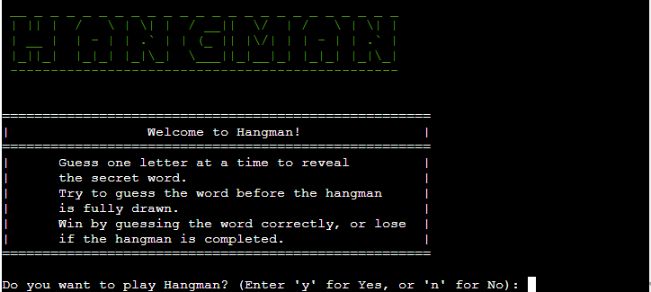
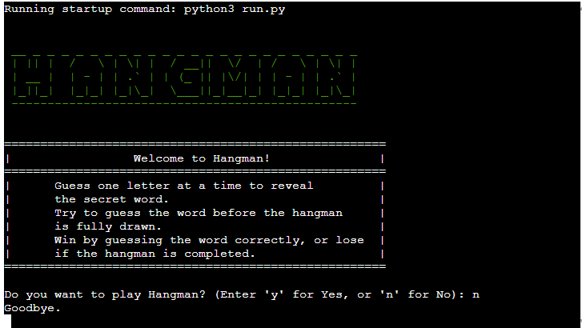
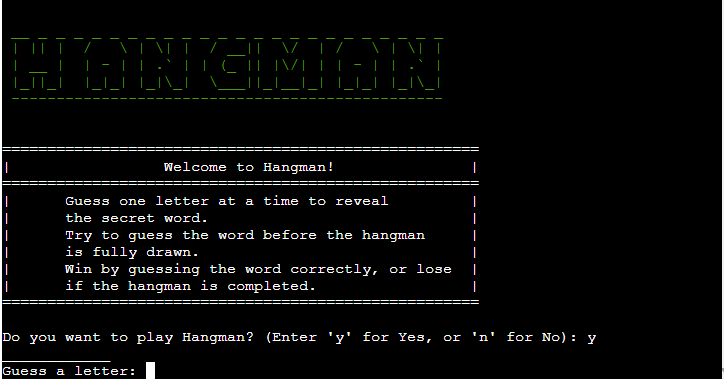
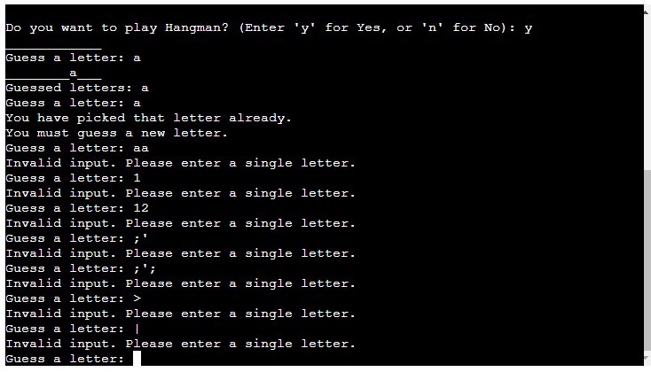
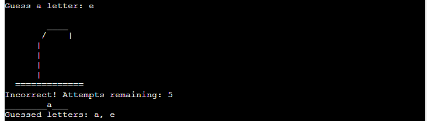
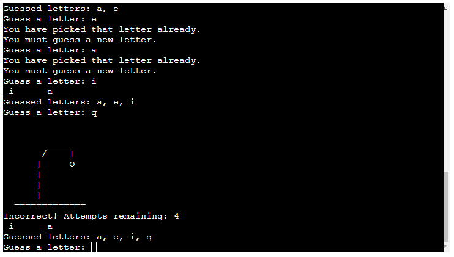
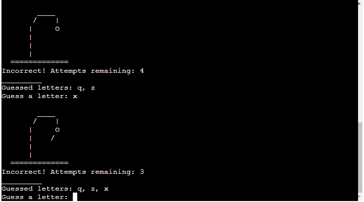
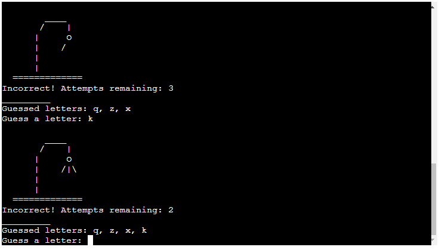
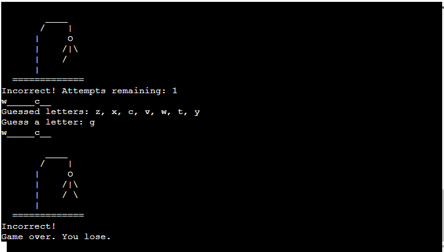

# Hangman

Welcome to the Python CLI Hangman Game! 
This command-line game is a fun and interactive way to test your vocabulary and word-guessing skills. Challenge yourself or play with friends to see who can guess the hidden word correctly.
### Deployed website [Hangman](xxx/ 'Hangman')

# How to Play
Hangman is a word-guessing game where one player (the computer) thinks of a word, and the other player (you) tries to guess that word by suggesting letters. You can read more about it on [Wikipedia](https://en.wikipedia.org/wiki/Hangman_(game) 'Hangman').

Here's how to play:

- Setup: The computer randomly selects a word and displays it as underscores for each letter (e.g., "_ _ _ _ _ _ _").

- Guessing: You start by guessing one letter at a time. If the guessed letter is correct, it's revealed in the word. If incorrect, the computer keeps track of incorrect guesses.

- Objective: Your goal is to guess the word before the computer completes drawing the hangman figure.

- Win or Lose: You win if you guess the word correctly. The computer wins if it completes the hangman figure before you guess the word.

- Strategy: Start with common vowels, avoid repeating incorrect guesses, and pay attention to the hangman figure's progress.

Enjoy playing Hangman against the computer in our Python CLI game!
# Features

## Existing Features
### Welcome screen
* When the game loads the player sees the Hangman logo. The logo has been created using ascii art, a welcome message and instructions on how to play the game are displayed.
* The user is asked if they want to play Hangman and prompted to enter 'y' for Yes or 'n' for No.

### Input validation
* The player input is validated. If the user does not enter either 'y' or 'n' they are prompted to enter a correct oprion.

### User selects 'n'
* If the user enters 'n' the game ends and a goodbye message is printed to the screen.

### User selects 'y'
* If the user eneters 'y' the game begins. 
* The programme makes a call to the Google Spreadsheet where various words are saved. 
* The programme randomly selects a word from a predefined list of words for the player to guess. 
* The programmes displays a blank space for each letter in the word (e.g. '________').

### Guessing 
* The player can guess letters one by one to reveal the hidden word.
* If the letter guessed by the player is a letter in the word, the display be will be updated with occureneces of that letter. 
* The programme will only accept a single alphanumeric character (a through z). 
* If the user doesn't enter a single alphanumeric character they will be asked to enter a single letter. 
* If the user has already entered a letter in a previous guess, they will be asked to enter a new letter.
* The letters that the user has guessed are displayed
 on the screen.

## Incorrect Guess Tracking: 
* The game keeps track of incorrect guesses and displays a hangman figure using ASCII art as the game progresses.
* The player has 6 lives when the game starts. Each time a player guesses incorrectly they lose a life and the hangman art is updated and displayed.

### Incorrect Guess One

### Incorrect Guess Two

### Incorrect Guess Three

### Incorrect Guess Four

### Incorrect Guess Five

# Win/Lose Conditions: 
* The game ends when the player either correctly guesses the word or makes too many incorrect guesses (hangman is fully drawn).

## Player Loses
* When the player runs out of lives the game ends.
* The completed hangman graphic is displayed along with a message telling thh user their letter chocie was incorrect and the game is over.

* This message is displayed for a number of seconds, after which the console is cleared and the game is loaded again. 
* The welcome screen is loaded and the player has the option to start a new game.

## Player Wins

- Word Reveal: After the game ends, the hidden word is revealed, and the player is given the option to play again.
## Future Features

## Data Model
The data model includes integration with Google Sheets using the Google Drive API and the gspread library in Python.
Authentication and authorization mechanisms are implemented to securely access the designated Google Spreadsheet. 
The Hangman game utilizes a designated Google Spreadsheet to store the words used in the game.
Each word is stored in a separate cell within the spreadsheet.
The data model includes functionalities to retrieve word data from the Google Spreadsheet programmatically using the gspread library.
When a new game is started the programme fetches the word data from the spreadsheet.
For each game session, the data model randomly selects a word from the retrieved list of words.
It then randomly selects a word from the retrieved list to be used in the current game session.

# Testing 

## Bugs
* The number of blanks being displayed initially does not seem to be the length of the word. Need to investigate and fix.
* There is an issue with the graphics being displayed. Sometimes getting the following error: File "run.py", line 138, in play_game
    print(GRAPHICS[counter]) IndexError: list index out of range. Need to fix. Could be to do with counter variable incrementing if the same letter is picked a number of times. Print counter to console to track. Code was refactored to so that it does not need a counter variable. The counter variable was causing issues when a player selected a letter that tehy had already selected.
* There was an issue with the update check_if_player_loses function. If a player ran out of lives and lost the game the incorrect graphic was being displayed. The code was updated so that if a user runs out of lives the last item in the GRAPHICS array is displayed (the completed hangman). This way when a player runs out of lives and the game is over the correct graphic will display.

### Solved Bugs
* During development the display was showing one more blank space than there were letters in the word to be guessed. This was solved by updating the range to be one less than the length of the word. 
* During development it was noticed a user could enter the same letter more than once. TODO. update input function so that letter can only be added by user once.

# Deployment

# Credits

For regex pattern to identify only single character entered by user, https://bobbyhadz.com/blog/python-input-only-accept-one-character